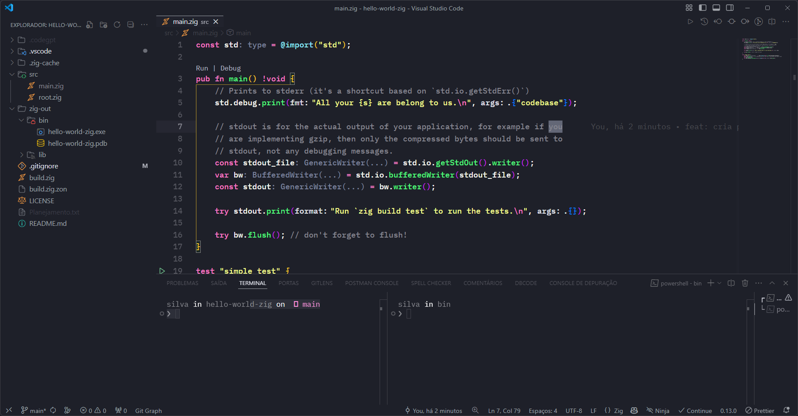
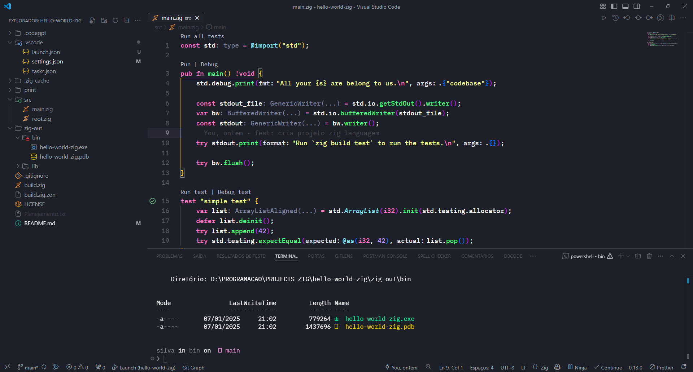

<h1 align="center">
    JOGO DE LUTA SAM
</h1>

<h4 align="center">
    Criando um um game de luta na linguagem ZIG
</h4>

## Sobre o game

🎮 Conheça o SAM - Meu Jogo de Luta Desenvolvido em Zig! 🥋⚔️

Estou empolgado em compartilhar meu projeto mais recente: SAM, um jogo de luta que estou desenvolvendo utilizando a linguagem Zig! 🚀

SAM é um projeto que combina alta performance e controle detalhado sobre os recursos do sistema, aproveitando todo o poder que Zig oferece para criação de jogos de baixo nível.

✨ Destaques do projeto:

⚡ Jogabilidade fluida graças à eficiência da linguagem Zig.
🎨 Gráficos otimizados, focados em desempenho e responsividade.
🛠️ Construído com foco em controle, sem sacrificar a experiência do jogador.

## Planejamento de estudo

```Plaintext
    Agenda:
    Data de Início: 07/01/2025

    1 - Primeiro modulo
    
    - [x] Gerar o primeiro programa - Ola Mundo
    - [x] Construção automatizada do Visual Studio Code
    - [x] Configurar depuração
    - [x] Configuração repositório github

    2 - Segundo Modulo
    - [ ] Configuração biblioteca raylib
    - [ ] Criar e visualizar primeira janela
    - [ ] Desenhando uma sprite
    - [ ] Analisando alguns designs para jogos de luta
```
## Imagens




## Descrição sobre a linguagem ZIG

Zig é uma linguagem de programação de baixo nível, projetada para ser simples, robusta e eficiente, com foco em sistemas embarcados e desenvolvimento de software próximo ao hardware. Ela foi criada como uma alternativa moderna ao C, oferecendo melhorias em segurança, desempenho e usabilidade, sem sacrificar o controle direto sobre os recursos do sistema.

### Principais características

- Sem coleta de lixo: Proporciona controle manual da memória.
- Segurança na memória: Detecta erros comuns, como uso de memória não inicializada e estouros de buffer, durante a compilação ou execução.
- Compilador de autocontenção: Inclui suporte embutido para compilar código C e C++, facilitando a interoperabilidade.
- Gerenciamento de erros explícito: Evita o uso de exceções e promove o tratamento direto de erros.
- Cross-compilation facilitada: O compilador Zig foi projetado para criar binários para diferentes plataformas de forma simples.

### Onde a linguagem Zig pode ser utilizada

- Desenvolvimento de sistemas operacionais: Devido ao controle próximo ao hardware.
- Sistemas embarcados: Zig é eficiente e utiliza poucos recursos.
- Desenvolvimento de jogos: Oferece baixo overhead e alta performance.
- Ferramentas e bibliotecas de baixo nível: Como drivers, compiladores ou programas utilitários.
- Interoperabilidade com C: Zig pode ser usado para substituir ou complementar código legado escrito em C ou C++.
- Aplicativos de alto desempenho: Projetos que exigem controle máximo sobre desempenho e uso de memória.

Zig é particularmente atrativa para desenvolvedores que precisam de controle detalhado do sistema e querem evitar as armadilhas comuns do C, enquanto aproveitam recursos modernos para maior segurança e produtividade.

## Executar o projeto

```bash
    # iniciar um projeto
    zig init

    # build do projeto
    zig build run

    # na pasta
    cd zig-out/bin

    # executar o aplicativo
    ./nome_do_seu_projeto.exe
```

## Documentação e ferramentas utilizada

- [ZIG guide](https://zig.guide/)
- [Acessos do ZIG](https://ziglang.org/learn/)
- [Biblioteca Build ZLS](https://github.com/zigtools/zls)
- [Documentação ZIG 13.0](https://ziglang.org/documentation/0.13.0/)

## Fonte de pesquisa

- [dev.to](https://dev.to/watzon/debugging-zig-with-vs-code-44ca)

## Licença

Este projeto é licenciado sob [CC0 1.0 Universal]. Consulte o arquivo [LICENSE](https://github.com/SilvaneiMartins/curso-zig/blob/master/LICENSE) para obter detalhes.

## Doações

Se você achar este projeto útil e quiser apoiar seu desenvolvimento contínuo, você pode fazer uma doação via `PIX` para e-mail `silvaneimartins@hotmail.com`.

Muito ❤️ pelo apoio!

## Contato

<a href="https://github.com/SilvaneiMartins">
    
    <br />
    <sub>
        <b>Silvanei de Almeida Martins</b>
    </sub>
</a>
     <a href="https://github.com/SilvaneiMartins" title="Silvanei martins" >
 </a>
<br />
🚀 Feito com ❤️ por Silvanei Martins